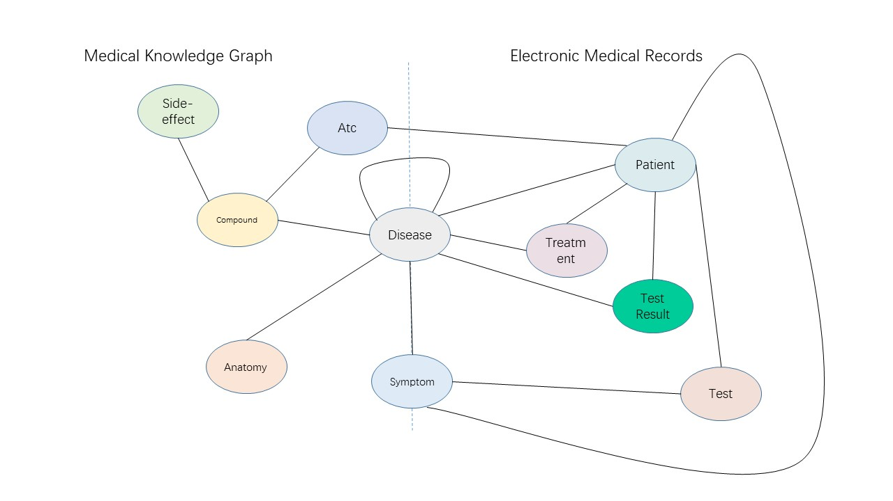

# Knowledge_graph_applied_on_CDS

## Clinical decision support systems

Clinical decision support systems (CDSS) aim to provide clinicians or patients with computer-generated clinical knowledge and patient-related information that can be intelligently filtered or presented at appropriate times, to enhance patient care.

## Purpose:

Electronic medical records (EMRs) contain an amount of medical knowledge which can be used for clinical decision support (CDS).

Our objective is a system that can extract and represent these knowledge contained in EMRs to support three CDS tasks: 

- Determining a patient’s most likely diagnosis given a list of symptoms
- Deciding on the most effective treatment plan for a patient with a known condition
- Determining if a particular test is indicated for a given situation

with the given condition of one patient.

## Knowledge graph

### Introduction:

Our knowledge graph is divided into two parts, the first consists of public medical knowledge from three databases: Drugbank, GNBR, and Hetionet, and the second consists of data on patients with different diseases extracted from hospital Electronic Medical records(EMR).

### Description of entity:

| Metanode    | Description                                                  |
| ----------- | ------------------------------------------------------------ |
| Compound    | Approved small molecule compounds with documented chemical structures. From [DrugBank](https://www.drugbank.ca/). |
| Anatomy     | Anatomical structures, excluding structures that are known not to be found in humans. From [Uberon](http://uberon.github.io/). |
| Disease     | Complex diseases, selected to be distinct and specific enough to be clinically relevant yet general enough to be well annotated. From [Disease Ontology](http://disease-ontology.org/). |
| Symptom     | Signs and Symptoms (i.e. clinical abnormalities that can indicate a medical condition). From the [MeSH ontology](https://www.nlm.nih.gov/mesh/meshhome.html). |
| Side Effect | Adverse drug reactions. From [SIDER](http://sideeffects.embl.de/)/[UMLS](https://www.nlm.nih.gov/research/umls/). |
| Atc         | ATC code (Antithrombotic agents) is a drug subgroup of the Anatomical, Therapeutic and Chemical Classification System for Drugs, which is administered by the WHO Collaborating Centre for Drug Statistics. From [DrugBank](https://www.drugbank.ca/). |
| Treatment   | Treatment consists of a number of surgical and nursing acts. From EMR |
| Test        | Test consists of a variety of medical tests. From EMR        |
| Test result | Test result is the test result of the Test and is used to confirm the diagnosis of the corresponding disease. From EMR |

## Statistics of knowledge graph

**About Entity:**

| Entity type | Drugbank | GNBR | Hetionet | EMR  | Total Entities |
| ----------- | -------- | ---- | -------- | ---- | -------------- |
| Anatomy     |          |      | 398      |      |                |
| Atc         | 4,048    |      |          |      |                |
| Compound    |          |      |          |      | 1,0458         |
| Disease     |          |      |          |      | 4,022          |
| Side Effect |          |      | 5,701    |      | 5,701          |
| Symptom     |          |      | 415      |      |                |
|             |          |      |          |      |                |
| Treatment   |          |      |          |      |                |
| Test        |          |      |          |      |                |
| Test result |          |      |          |      |                |

**About Relation:**

| Entity-type pair        | Drugbank | GNBR   | Hetionet | EMR  | Total interactions |
| ----------------------- | -------- | ------ | -------- | ---- | ------------------ |
| (Atc, Compound)         | 15,750   |        |          |      |                    |
| (Compound, Disease)     | 4,968    | 77,782 | 1,145    |      | 83,895             |
| (Disease, Symptom)      |          |        | 3,357    |      |                    |
| (Anatomy, Disease)      |          |        | 3,602    |      |                    |
| (Disease, Disease)      |          |        | 543      |      |                    |
| (Compound, Side Effect) |          |        | 138,944  |      |                    |
| (Treatment, Disease)    |          |        |          |      |                    |
| (Test Result, Disease)  |          |        |          |      |                    |
| (Patient, Atc)          |          |        |          |      |                    |
| (Patient, Disease)      |          |        |          |      |                    |
| (Patient, Treatment)    |          |        |          |      |                    |
| (Patient, Test Result)  |          |        |          |      |                    |
| (Patient, Symptom)      |          |        |          |      |                    |
| (Test, Symptom)         |          |        |          |      |                    |
| (Test, Patient)         |          |        |          |      |                    |

